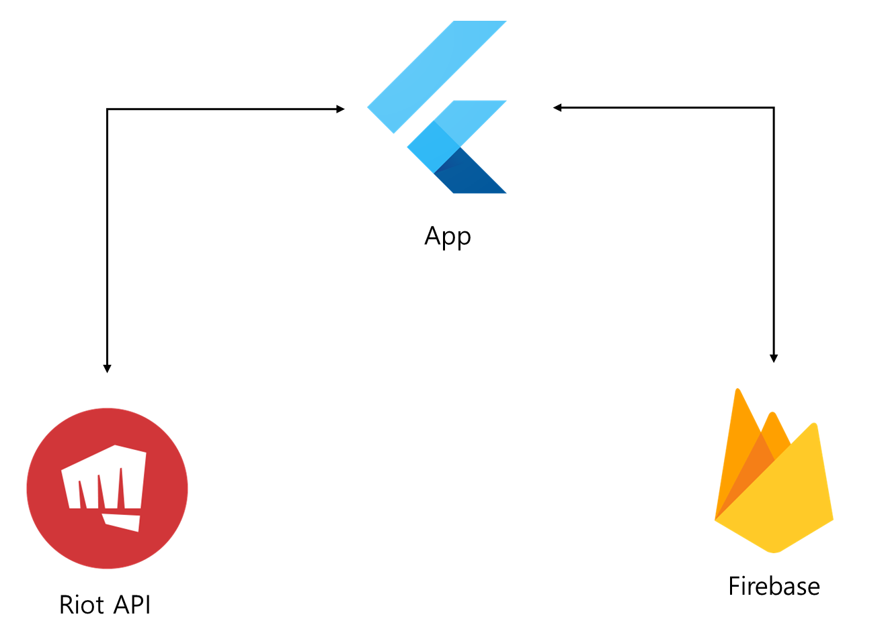

# 롤체위키

> 2024.01. - 2024.04.
>
> 개인프로젝트

## 🛠 Skills

- dart, Flutter
- Firebase

## 🎲 프로젝트 개요

> 리그 오브 레전드의 전략적 팀 전투에 대한 게임 정보와 전적을 보여주는 애플리케이션 서비스 입니다.

## 💡 기능

- 소환사 전적 검색
- 챔피언 ,특성, 아이템 정보 보기 및 검색
- 아이템 조합식 표현
- 소환사 즐겨찾기
- 검색 기록 저장

## ✨ 특징

- Riot Api와 연결
- Api 호출을 줄이기 위한 로컬 캐싱 시스템
  - 효율 : N(1 + M) → N + M
    - N = 특정 소환사 검색 횟수
    - M = 매치 데이터 조회수
- Firestore와 연결하여 앱의 정보를 실시간으로 변경 가능
- 리스트의 요소를 비동기적으로 불러 올 수 있는 LoadableListView
- 비동기 함수의 완료와 함께 닫히는 다이얼로그
- Getx를 이용한 상태 관리

## ⚙ 시스템 구성도

